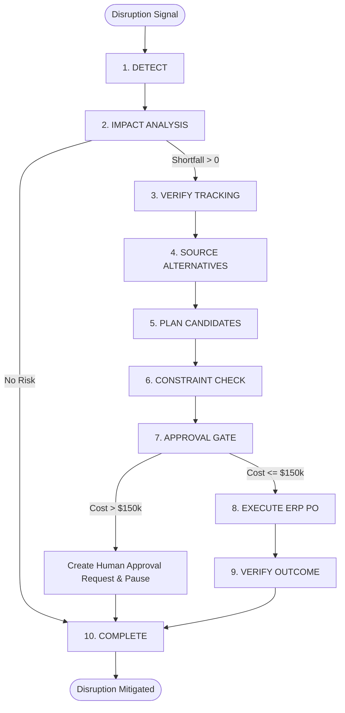

# 🌐 Supply Chain Disruption Control Agent

> **Autonomous Disruption Mitigation with Deterministic Governance & Human-in-the-Loop Safeguards**  
> *Built for Enterprise Supply Chains · Hackathon MVP*

---

## 📌 Executive Summary

When a primary supplier reports a critical delay, traditional supply chain teams lose 3 to 5 days manually analyzing inventory burn rates, cross-referencing BOMs, and searching for compliant alternative suppliers. In manufacturing, a 4-day component deficit means an **imminent factory line shutdown** costing hundreds of thousands of dollars per hour.

The **Supply Chain Disruption Control Agent** solves this through **governed AI autonomy**:
- **Multi-Signal Reconciliation**: Automatically detects when supplier dispatch claims contradict carrier tracking manifests (`NO_LABEL_CREATED`).
- **Deterministic Math & Compliance**: Zero hallucination risk — inventory coverage calculations, ISO-9001 compliance gating, and supplier capacities are evaluated by pure deterministic code.
- **Autonomous vs. Human-in-the-Loop Threshold**: Autonomous execution for solutions $\le \$150,000$; hard workflow pause with rich context emission for solutions $> \$150,000$.
- **Real-Time Event Streaming**: Server-Sent Events (SSE) stream every agent step, tool call, and decision diff live to the operations dashboard.

---

## 🏛️ Core Architectural Principle

```
┌──────────────────────────────┐
│  AI Cognition (LangGraph)    │  ◄── Proposes candidate actions & reasons
└──────────────┬───────────────┘
               │
               ▼
┌──────────────────────────────┐
│ Deterministic Engine (PureTS)│  ◄── AUTHORIZES (ISO-9001, Budget, Capacity)
└──────────────┬───────────────┘
               │
       ┌───────┴───────┐
       ▼               ▼
[Cost ≤ $150k]   [Cost > $150k]
Autonomous ERP   Human Approval Gate
Execution        (Interactive Review)
```

> **"The LLM proposes, the Deterministic Engine disposes."**  
> The LLM has zero authority to approve purchases, perform financial calculations, or bypass regulatory rules.

---

## 🚀 Tech Stack

| Layer | Technology |
|---|---|
| **Frontend Framework** | **Next.js 15** (App Router, React 19, Vanilla CSS Design System) |
| **Runtime & Language** | Node.js (v20+), TypeScript (Strict Mode) |
| **Server Framework** | Fastify v5 (Ultra-low latency, SSE support) |
| **Agent Orchestration** | LangGraph.js (10-Node State Machine with conditional routing) |
| **Database & ORM** | PostgreSQL (Neon Serverless) via Prisma ORM |
| **Schema Validation** | Zod (100% typed inputs and outputs for all agent tools) |
| **Test Runner** | Vitest (76 unit & integration tests, 100% pass rate) |

---

## 🎬 The Demo Scenario (`PO-7712` Disruption)

| Parameter | Value | Impact |
|---|---|---|
| **Component** | `COMP-104` (Micro-Controller Module) | Critical assembly dependency |
| **Current Stock** | 420 units | Daily burn rate: 100 units/day |
| **Usable Coverage** | **4.2 days** | Depletion countdown begins |
| **Production Order** | `PROD-882` (ECU Assembly Line A) | Target: **700 units** in **4.0 days** |
| **Calculated Deficit** | **280 units** | ⚠️ **Factory line shutdown in 4 days** |
| **Disrupted PO** | `PO-7712` via `SUP-21` | Claimed: *"Dispatched / 5-day delay"* |
| **Carrier Reality** | `NO_LABEL_CREATED` | 🚨 **Contradiction Detected** (Cargo never shipped) |

### Supplier Matrix & Compliance Guardrails

| Supplier Code | Name | ISO-9001 Certified | Capacity | Lead Time | Unit Price | Constraint Engine Verdict |
|---|---|:---:|:---:|:---:|:---:|---|
| `SUP-21` | Global Components Ltd | ✅ | 0 | 5 days | $120 | ❌ Disrupted & 0 capacity |
| `SUP-18` | CheapParts Mfg | ❌ | 600 | 1 day | $85 | ❌ **HARD BLOCKED** (No ISO-9001) |
| `SUP-37` | Certified Components Co | ✅ | 500 | 3 days | $145 | ✅ **RECOMMENDED** ($40,600 total, arrives in 3 days) |
| `SUP-42` | Rapid Components | ✅ | 300 | 1 day | $260 | ⚠️ Expedited ($72,800 total, premium price) |

---

## 🔄 LangGraph 10-Node Decision Graph



---

## 📡 REST & Real-Time SSE API

### Core Endpoints

| Method | Endpoint | Description |
|---|---|---|
| `GET` | `/api/health` | Service health check |
| `GET` | `/api/demo/state` | Full scenario graph (live stock, suppliers, tracking contradiction) |
| `POST` | `/api/demo/reset` | Resets database to initial deterministic state |
| `POST` | `/api/agent/run` | Triggers the complete 10-step autonomous agent workflow |
| `POST` | `/api/agent/resume` | Resumes paused workflow after human approval |
| `GET` | `/api/agent/events/:disruptionId` | **Live SSE Stream** (replays history + live step broadcast) |
| `GET` | `/api/approvals?status=PENDING` | Lists pending Human-in-the-Loop approval requests |
| `GET` | `/api/approvals/:id` | Detailed contextual payload for operations managers |
| `POST` | `/api/approvals/:id/approve` | Explicit human approval $\rightarrow$ triggers PO creation |
| `POST` | `/api/approvals/:id/reject` | Explicit human rejection $\rightarrow$ marks plan rejected |

---

## 🛡️ Immutable Audit Ledger

Every single tool invocation, state transition, and governance decision is persisted to the `audit_logs` table with:
- **Actor Type**: `AGENT`, `USER`, or `SYSTEM`
- **Action**: e.g., `DISRUPTION_DETECTED`, `SUPPLIER_CONTRADICTION_DETECTED`, `HUMAN_APPROVAL_GRANTED`
- **Reasoning**: Human-readable explanation of why the action was chosen
- **State Diff**: Previous state vs. new state snapshot
- **Timestamp**: High-precision UTC timestamp

---

## 🧪 Automated Testing & Verification

Run the full test suite with 100% pass rate:

```bash
cd backend
npm test
```

```
✓ tests/inventoryCalculator.test.ts   (9 tests)
✓ tests/supplierValidator.test.ts     (6 tests)
✓ tests/budgetValidator.test.ts       (6 tests)
✓ tests/recoveryValidator.test.ts     (8 tests)
✓ tests/tools.test.ts                (24 tests)
✓ tests/agent.test.ts                 (5 tests)
✓ tests/approvals.test.ts            (13 tests)
✓ tests/events.test.ts                (5 tests)

Test Files  8 passed (8)
     Tests  76 passed (76)
```

---

## ⚡ Quick Start Guide

### 1. Prerequisites
- Node.js v20+
- PostgreSQL database (or Neon connection string)

### 2. Installation
```bash
cd backend
npm install
```

### 3. Configure Environment
Create `.env` inside `backend/`:
```env
PORT=3001
HOST=0.0.0.0
NODE_ENV=development
DATABASE_URL="your-postgresql-url"
CORS_ORIGIN="http://localhost:3000,http://localhost:5173"
OPENAI_API_KEY="your-openai-key"
OPENAI_MODEL="gpt-4o-mini"
```

### 4. Push Schema & Seed Scenario
```bash
npm run prisma:push
npm run db:seed
```

### 5. Start Backend Server
```bash
npm run dev
```
Server runs at `http://localhost:3001`.

---

## 👥 Team
- **Backend & Agent Architecture**: Supply Chain Disruption Control Agent Team
- **Frontend Dashboard**: Next.js Real-time Operations Portal
