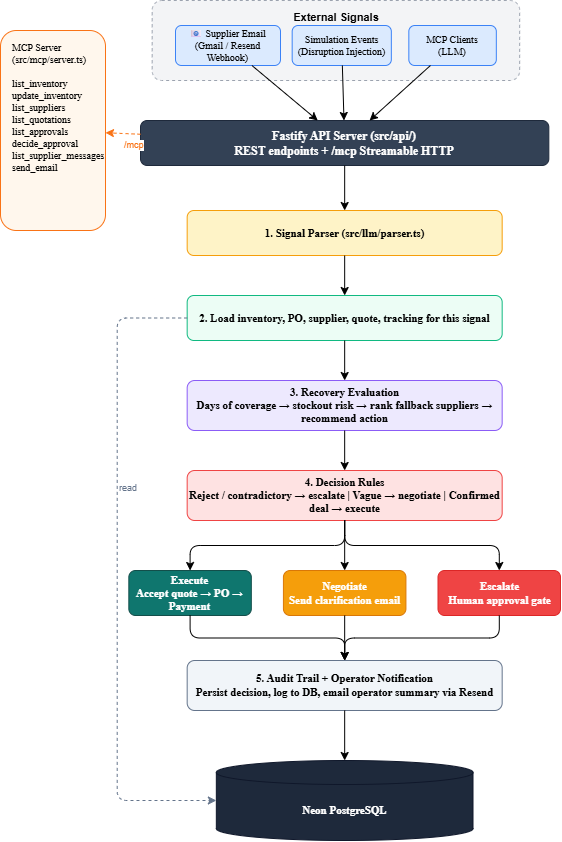

# Supply Chain Disruption Control Agent

### Detect. Decide. Recover.

**seed42 is a supply-chain disruption recovery simulator that turns conflicting supplier, inventory, tracking, and production signals into a controlled, explainable response.**

 

---

<table>
<tr>
<td width="33%" valign="top">

### Data & operations

 
 
 

</td>
<td width="33%" valign="top">

### Agent & automation

 
 
 

</td>
<td width="33%" valign="top">

### Control & delivery

 
 
 
 
 

</td>
</tr>
</table>

---

## 1. What did we do?

We built seed42 around one practical flow: **operational signals → recovery decision → controlled action → audit trail**. A supplier delay, a tracking mismatch, an inventory correction, or a priority change enters the system; then the agent connects it to the component, purchase order, production deadline, and usable-stock position. That is the moment where a vague problem becomes a decision.

From there, seed42 calculates days of coverage and the production shortfall. If the line can survive the delay, it monitors the original PO and records why waiting is sensible. If the line is at risk, it compares fallback suppliers by required certification, reliability, lead time, expedite availability, and cost. We are not trying to make a spreadsheet look intelligent. We are trying to stop a line from going quiet.

| Signal | Response in the system model |
|:--|:--|
| Supplier delay, quote, or confirmation | Extract the PO/component context and enrich the disruption record. |
| Inventory or production change | Recalculate usable coverage, shortfall, and stockout risk. |
| “Dispatched” but no carrier movement | Flag the contradiction before trusting the supplier claim. |
| Line stockout risk | Build a qualified recovery plan, then check spend authority. |
| New information after a decision | Re-evaluate from the current operational snapshot. |

## 2. Why did we do it?

We did it because production disruptions are rarely one clean alert. They are usually a pile of half-truths: an optimistic supplier email, a stock number that includes unusable material, a courier update that says something else, and a deadline that refuses to move. Waiting for a long meeting in that situation is like waiting to fix a leak until the floor is wet.

The agent puts production continuity first, then cost discipline. Still, “fastest” is not automatically “best.” A cheap supplier that misses the certification is not a recovery option. A quick supplier with weak reliability may only delay the next problem. seed42 makes the trade-off visible, and it hands expensive or uncertain decisions to an operations manager rather than pretending that autonomy is always clever.

## 3. What is the system architecture?

The architecture is deliberately vertical. It reads like an operations hand-off, not a maze: first establish the facts, then decide whether the line is actually threatened, then spend only with the right authority, and finally leave a record someone can understand later.

Today, the shared data layer is a Neon/PostgreSQL simulation of inventory, purchase orders, supplier capabilities, tracking, and production schedules. The control room and agent runs are real project features; external ERP, warehouse, carrier, and supplier-portal integrations are future connection points. The model is ready for them, but we do not claim they already exist.

## 4.  What is our unique selling point?

### MCP — the tool bridge

seed42 ships a [Model Context Protocol](https://modelcontextprotocol.io) server (`src/mcp/`). Any MCP-compatible client — Cursor, Claude Desktop, a custom agent — can call the same operational helpers the web control room uses, over **stdio** (default) or **Streamable HTTP** (`/mcp` on the API port, session-based).

| Tool | What it does |
|:--|:--|
| `list_inventory` | Returns live component inventory with computed days-of-coverage. |
| `update_inventory` | Adjusts current and usable stock for a component; reason is logged to the ERP audit trail. |
| `list_suppliers` | Lists active supplier contacts and reliability rankings, optionally filtered by component. |
| `list_quotations` | Returns all supplier quotations saved against RFQs. |
| `list_approvals` | Lists human-in-the-loop approvals (pending, approved, rejected). |
| `decide_approval` | Approve or reject an existing approval gate, with optional notes. |
| `list_supplier_messages` | Returns inbound/outbound supplier emails, filterable by direction, supplier, or PO. |
| `send_email` | Sends an email to a supplier contact via Resend and logs it to the database. |

Every tool is a thin pass-through to the simulation service layer (`src/sim/`). Business rules, validation, and audit logging stay in the service — MCP only exposes the boundary. An AI assistant and the control room always operate on the same data, under the same constraints.

### Simulation engine

The simulation layer (`src/sim/`) provides a discrete-time environment that models a live factory floor without touching one. A global clock (`simulation.simulation_state`) tracks the current time step. Events are scheduled at future steps and fire automatically when the clock advances via `advanceSimulationTime(steps)`:

| Event type | Side-effect |
|:--|:--|
| `inventory_correction` | Sets usable stock for a component to a target value. |
| `demand_spike` | Overwrites daily usage rate for a component. |
| `supplier_delay` | Marks a purchase order as `delayed`. |
| `expedite_unavailable` | Disables expedited shipping for a supplier–component pair. |

Disruptions are injected with `injectDisruption()` — type, severity, affected component, and optional PO/production-order links — and logged to the ERP audit trail. When a disruption threatens a line, the recovery evaluator fetches inventory, calculates days-of-coverage and shortfall, filters suppliers by certification, and scores them by deadline fit → reliability ≥ 0.80 → lowest cost. The output is a structured recommendation: `wait_for_original_po`, `place_emergency_order`, or `escalate_unresolvable_stockout`.

### Inventory intelligence

Inventory is the signal that makes everything else useful. The inventory module (`src/sim/inventory.ts`) tracks per-component:

| Field | Meaning |
|:--|:--|
| `current_stock` | Total physical units in the warehouse. |
| `usable_stock` | Units that pass quality checks and are available for production. |
| `daily_usage` | Average consumption rate per day. |
| `safety_stock` | Minimum buffer before a shortage is flagged. |
| `days_of_coverage` | Computed: `usable_stock / daily_usage`. The number that decides whether a delay is survivable. |

Days-of-coverage is the single metric the system hinges on. A 7-day supplier delay with 4 days of coverage means the line will stop; with 12 days, the delay is absorbable. Stock updates are validated (no negatives), diffed against previous state, and written to the ERP audit log with a reason. MCP, the event engine, and the control room all share the same service functions — inventory is always consistent across every interface.

## 5. What problems did we face?

The difficult part was uncertainty. Supplier messages are messy and sometimes too confident; “dispatched” does not mean much if tracking still says label created. So we treat supplier communication as a signal, not proof, and check it against the operational record.

Supplier choice was another trap. The fastest quote can fail quality requirements, a reliable supplier can have limited capacity, and expedited freight can disappear exactly when everyone needs it. Our recovery model filters for qualification first and makes risk, cost, and delivery time explicit. When the evidence is weak—or the recovery cost crosses the approval limit—it stops and asks a person. A small pause there is better than an expensive wrong turn.

Finally, plans expire. A demand spike, revised production priority, stock adjustment, or fresh tracking event can make yesterday’s answer useless. seed42 is designed to re-enter the same enrichment and evaluation path with the new facts, then preserve both the new decision and the reason behind it.

---

**seed42 — fast recovery, clear authority, and decisions that can survive a Monday-morning review.**

